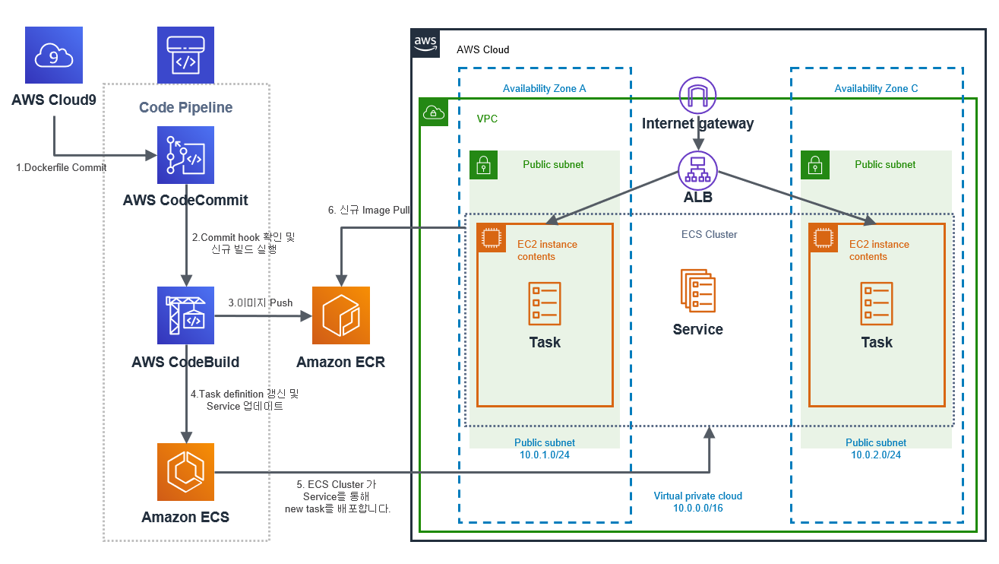
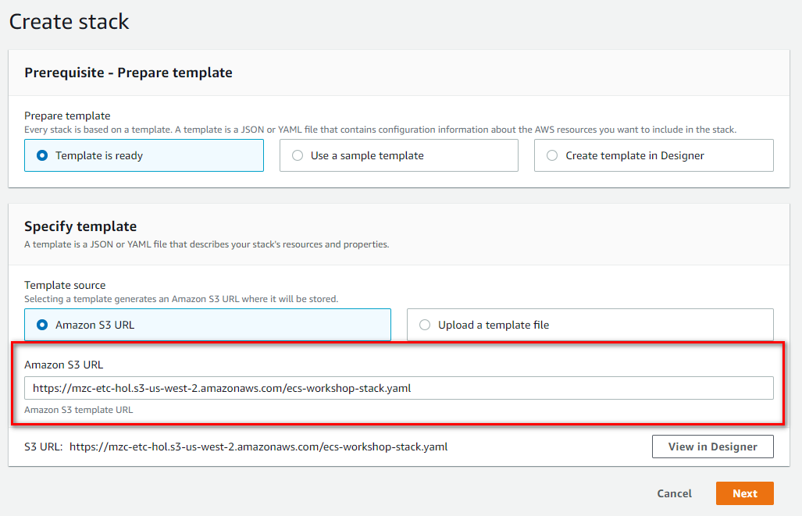
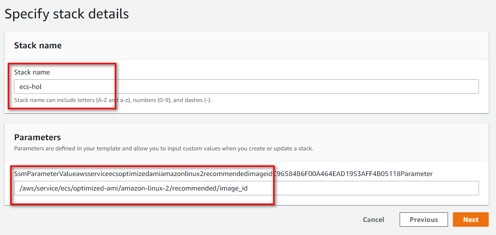
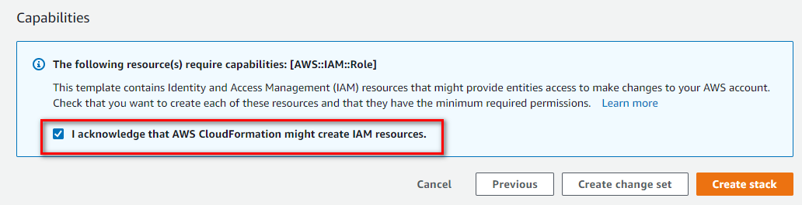
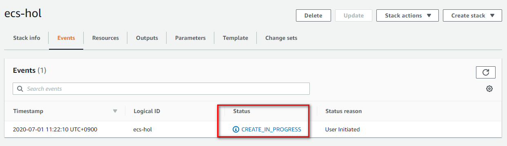
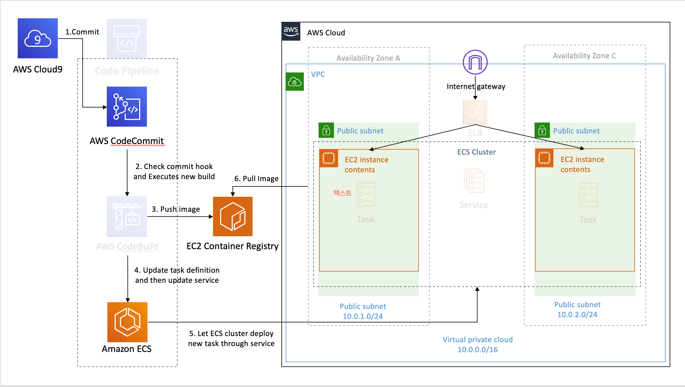

# CICD for ECS Hands On LAB

> **본 Hands on Lab은 Oregon region( us-weat-2 ) 을 기준으로 작성되었습니다. 실습을 하실 때 반드시 리전을 확인하기 바랍니다.**

## Overall Archtecture

본 HOL통해서 아래와 같은 아키텍처를 구성합니다. 이번 실습을 통하여 AWS상의 VPC위에 EC2기반의 ECS 클러스터를 생성하고 nginx컨테이너를 ECS클러스터 위에 배포합니다. 이를 위해서 ECS클러스터를 위한 Task definition 및 Service 를 생성하고 Code Pipeline으로 파이프라인을 생성하여 지속적으로 소스를 빌드하고 배포합니다.

추가적으로 각 구성요소에 대한 상세한 내용을 알고 싶으시다면 다음의 리소소들을 참조해주세요.

- [What is AWS VPC?](https://docs.aws.amazon.com/vpc/latest/userguide/what-is-amazon-vpc.html)
- [What is Elastic Load Balancing](https://docs.aws.amazon.com/elasticloadbalancing/latest/userguide/what-is-load-balancing.html)
- [What is Amazon Elastic Container Service?](https://docs.aws.amazon.com/AmazonECS/latest/developerguide/Welcome.html)
- [What is Amazon Elastic Container Registry?](https://docs.aws.amazon.com/AmazonECR/latest/userguide/what-is-ecr.html)
- [What Is AWS CodePipeline?](https://docs.aws.amazon.com/codepipeline/latest/userguide/welcome.html)

## Cloudformation Template을 이용한 자원 생성
본 실습을 시작하기 전에 필요한 AWS 리소스를 생성해야 합니다. 실습에 필요한 리소스는 AWS CloudFormation을 사용하여 구성합니다.

실습에 필요한 AWS 리소스를 사전에 생성하기 위해 제공된 CloudFormation template을 사용하여 CloudFormation stack을 생성합니다. 스택을 생성하면 실습에 사용할 VPC 리소스, ECS Cluster인스턴스와 Dockerfile 작성을 위한 Amazon Cloud9, Codecommit 등이 생성 됩니다. 이 모든 리소스는 ECS Hands On Lab을 진행하는 데 필요합니다.

CloudFormation 스택을 시작하려면, Launch Stack 버튼 을 클릭해서 CloudFormation 콘솔로 이동합니다.

- [Launch Stack (us-west-2)](https://console.aws.amazon.com/cloudformation/home?region=us-west-2#/stacks/new?stackName=ecs-hol&templateURL=https://mzc-etc-hol.s3-us-west-2.amazonaws.com/ecs-workshop-stack.yaml)

### Create stack 화면

Template경로가 Amazon S3인지 확인 후 **"Next"** 

### Stack 이름 확인 및 기본 파라메터 설정

Configure stack options 화면에서 기본 설정을 유지하고 **"Next"**

Review ecs-hol 화면에서 기본 설정을 유지하고 **"Next"** 

### Stack 설정 내용 리뷰 및 Stack 생성

화면 하단의 "Capabilities" 영역에서 클라우드포메이션이 IAM 리소스생성하는것에 대한 승인여부를 체크하고 **"Create stack"** 버튼 클릭합니다.

ecs-hol 스택의 상세화면으로 전환되고, 스택의 Status가 **CREATE_IN_PROGRESS**에서 **CREATE_COMPLETE**으로 완료될때까지 기다려 주십시오.(예상시간 10분 <) 

생성되는 리소스는 다음과 같습니다.:

- VPC
- IGW
- Subnet1, Subnet2
- Default Security Group 설정
- Amazon Cloud9
- Amazon ECR
- AWS CodeCommit
- Amazon ECS Cluster

## Cloud 9 셋업하기 및 ECR 레포지토리에 이미지 푸시하기 ( 10분 소요 )

이 단락에서는 AWS의 Web IDE인 Cloud9 워크 스페이스를 생성하고 Elastic Container Registry 서비스를 이용하여 컨테이너 이미지들을 저장할 Image Registry를 등록합니다. 또한 컨테이너를 배포할 ECS 클러스터를 위한 VPC를 생성합니다. 이번 단락에서는 Docker의 기본적인 명령어를 확인 합니다.

0. [Cloud9 접속](https://us-west-2.console.aws.amazon.com/cloud9/home?region=us-west-2#)

1. [Cloud9으로 Docker 기초 실습하기](doc/cloud9-docker-basic.md)

2. [ECR 리포지토리에 nginx 도커 이미지 푸쉬하기](doc/create-ecr-repository.md)

## ECS 클러스터 생성 및 Task Definition / Service 등록하기 (30분 ~ 45분 소요)

이 단락에서는 ECS의 배포 단위인 Task에 맞춰서 Task Definition을 정의하고 그를 이용하여 ECS에 Task를 배포하는 Service를 정의합니다. 이를 통해서 nginx 웹서버를 ECS 클러스터상에 배포하여 실제로 동작을 확인합니다.

1. [Task Definition 작성하기](doc/create-task-definition.md)

3. [Service에서 사용할 Application Load Balancer 생성하기](doc/create-alb.md)

4. [Service 작성하여 서비스 배포하기](doc/create-service.md)

## Code Commit, Code Build, Code Pipeline으로 CI/CD 파이프라인 구성하기 ( 30분 ~ 45분 소요)

이 단락에서는 형상의 소스들을 지속적으로 배포하고 빌드하여 ECR에 푸쉬하고 ECR cluster 상의 task들을 지속적으로 배포하기 위한 파이프라인을 생성합니다. AWS의 완전 관리형 Git repository인 Code Commit에 형상 저장소를 만들고 지속적인 빌드를 위하여 Dokcerfile 및 buildspec.yml을 작성하여 형상에 커밋합니다. 그리고 Code Pipeline에서 생성한 파이프라인으로 앞에서 생성한 ECS의 클러스터상의 Service를 업데이트하여 지속적인 배포를 수행합니다.

 아래의 항목들을 차례대로 수행합니다.

1. [Code Commit의 Git Repository 확인 및 Cloud9에 형상 clone 하기](doc/create-codecommit-repo.md)

2. [Code Commit Repository에 Dockefile 및 buildspec.yaml 추가하기](doc/create-resource-for-build.md)

3. [Cope Pipeline을 생성하여 ECS에 지속적인 배포하기](doc/create-pipeline.md)

## 실습후 리소스 삭제하기

> 실습후 반드시 리소스들을 삭제합니다. 제대로 삭제를 하지 않는다면 실습하신분의 계정으로 요금이 청구될 수 있습니다. 실습때 받은 credit이 있다면 등록을 해주시길 바랍니다.

1. Codepipeline 삭제
2. ECS Service 삭제
3. ECS Task Definition 삭제 (Task Definition 안의 버젼을 등록해제하면 삭제됩니다.)
4. ALB 삭제
5. Target Group 삭제
6. ECR 삭제
7. Cloudformaion 스택 삭제
