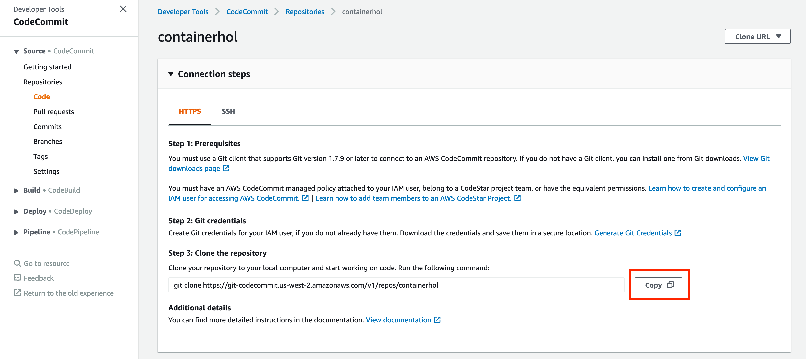

# CodeCommit 리포지토리 확인

1. 다음의 링크에서 [https://console.aws.amazon.com/codesuite/codecommit/home](https://console.aws.amazon.com/codesuite/codecommit/home) 에서 CodeCommit 콘솔을 엽니다.

2. Repositories 페이지에서 Cloudformation으로 생성한 containerhol repository를 선택합니다.

3. 생성된 내용을 확인합니다.

## CodeCommit 콘솔 연결 및 리포지토리 복제

1. [https://console.aws.amazon.com/codesuite/codecommit/home](https://console.aws.amazon.com/codesuite/codecommit/home) 에서 CodeCommit 콘솔을 엽니다.

2. 오른쪽 상단에서 리전 선택메뉴에서 oregon 리전을 선택합니다. 리포지토리는 한 AWS 리전에 국한됩니다.

3. 목록에서 연결하려는 리포지토리명을 클릭합니다. 그러면 해당 리포지토리의 코드 페이지가 열립니다.

4. Step 3: Clone the repository 항목에 있는 명령어를 Copy버튼을 눌러서 복사합니다.

    

5. [Cloud9 대쉬보드 화면으로 이동하여](https://us-west-2.console.aws.amazon.com/cloud9/home?region=us-west-2) 앞에서 생성한 워크스페이스 항목에서 Open IDE 버튼을 눌러 개발환경을 엽니다.

6. 사용자의 홈 디렉토리로 아래의 environment로 이동합니다. Cloud9의 터미널에서 아래의 명령어를 실행합니다.

     ```bash
     cd ~/environment
     ```

7. 터미널 화면에서 위의 4에서 복사한 명령어를 붙여넣고 실행합니다.

     ```bash
     git clone https://git-codecommit.us-west-2.amazonaws.com/v1/repos/containerhol
     ```

8. 정상적으로 입력했다면 다음과 같은 화면을 볼 수 있습니다.

     ```bash
     warning: You appear to have cloned an empty repository.
     ```

9. 정상적으로 Code Commit 리포지토리를 생성하였으며 테스트를 완료했습니다.

## [다음: Code Commit Repository에 Dockefile 및 buildspec.yaml 추가하기](create-resource-for-build.md)

## [메인페이지로 돌아가기](../README.md)

## [이전: Service 작성하여 서비스 배포하기](create-service.md)
