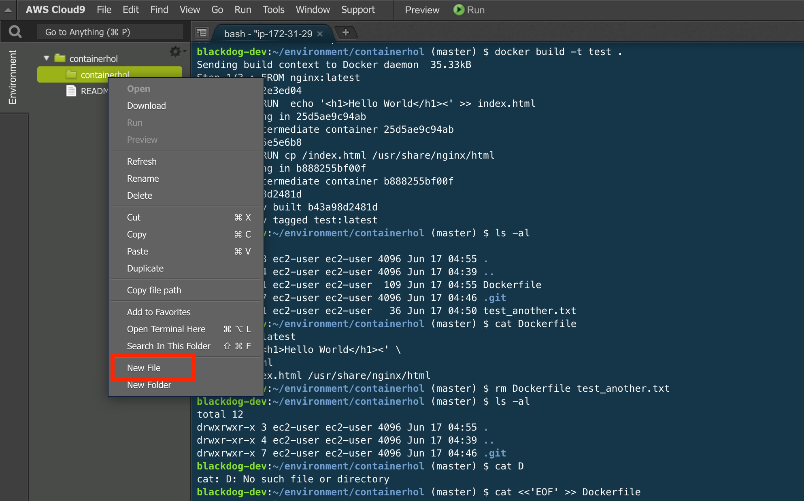

# [Code Commit Repository에 Dockefile 및 buildspec.yaml 추가하기](title)

## buildspec.yaml 추가하기

1. (선택사항) 다음의 링크에서 [https://us-west-2.console.aws.amazon.com/cloud9/home?region=us-west-2](https://us-west-2.console.aws.amazon.com/cloud9/home?region=us-west-2) 에서 **containerhol** 워크스페이스에서 Open IDE 버튼을 눌러 Cloud9 워크스페이스를 누릅니다.

2. 워크스페이스의 터미널 창에서 다음의 명령어를 실행하여 Code commit reposotory를 클론한 디렉토리명을 확인합니다.

    ```bash
    cd ~/environment/
    ls -al
    ```

    다음과 같이 출력이 됩니다.

    ```bash
    ls -al
    total 20
    drwxr-xr-x  4 ec2-user ec2-user 4096 Jun 17 04:39 .
    drwx------ 15 ec2-user ec2-user 4096 Jun 17 04:29 ..
    drwxr-xr-x  3 ec2-user ec2-user 4096 Jun 12 05:19 .c9
    drwxrwxr-x  3 ec2-user ec2-user 4096 Jun 13 07:08 containerhol
    -rw-r--r--  1 ec2-user ec2-user  569 Jun  3 09:22 README.md
    ```

3. 다음의 명령어를 실행하여 디렉토리 안으로 이동합니다.

    ```bash
    cd containerhol
    ```

4. 다음의 명령어를 실행하여 git repository의 상태를 확인합니다.

    ```bash
    git status
    ```

    다음과 같이 출력이 됩니다.

    ```bash
    blackdog-dev:~/environment/containerhol (master) $ git status
    On branch master

    No commits yet

    nothing to commit (create/copy files and use "git add" to track)
    blackdog-dev:~/environment/containerhol (master) $
    ```

5. 워크스페이스의 왼쪽 메뉴 탐색창에서 repository의 디렉토리를 선택하고 마우스 오른쪽 버튼을 눌러서 New File 메뉴를 눌러 새로운 파일을 추가합니다. 다시 오른쪽 버튼을 눌러 Rename을 선택하고 파일 이름을 **Dockerfile** 로 지정합니다.

    

    > 확장자와 대소문자에 유의해서 입력합니다. 파일명은 **Dockerfile** 입니다. 확장자가 없습니다.

6. Dockerfile을 더블클릭해서 편집창을 열고 다음의 내용을 복사하여 붙여넣고 저장합니다.

    ```Dockerfile
    FROM nginx:latest
    RUN  echo '<h1>Hello World</h1>' \
    >> index.html
    RUN cp /index.html /usr/share/nginx/html
    ```

7. 5에서 했던 방법으로 **buildspec.yml" 파일을 추가합니다.

    > 대소문자에 유의해서 입력합니다. 파일명은 **buildspec.yml** 입니다.

8. buildspec.yml 을 더블킬릭해서 편집창을 열고 다음의 내용을 복사합하여 붙여넣고 저장합니다.

    > 들여쓰기 및 띄워쓰기 간격이 아래의 텍스트와 동일하도록 입력합니다!

    ```yaml
    version: 0.2

    phases:
      pre_build:
        commands:
          - echo Logging in to Amazon ECR...
          - aws --version
          - $(aws ecr get-login --region $AWS_DEFAULT_REGION --no-include-email)
          - REPOSITORY_URI=<YOUR_ACCOUNT_ID>.dkr.ecr.us-west-2.amazonaws.com/containerhol/webapphol 
          - COMMIT_HASH=$(echo $CODEBUILD_RESOLVED_SOURCE_VERSION | cut -c 1-7)
          - IMAGE_TAG=${COMMIT_HASH:=latest}
      build:
        commands:
          - echo Build started on `date`
          - echo Building the Docker image...
          - docker build -t $REPOSITORY_URI:latest .
          - docker tag $REPOSITORY_URI:latest $REPOSITORY_URI:$IMAGE_TAG
      post_build:
        commands:
          - echo Build completed on `date`
          - echo Pushing the Docker images...
          - docker push $REPOSITORY_URI:latest
          - docker push $REPOSITORY_URI:$IMAGE_TAG
          - echo Writing image definitions file...
          - printf '[{"name":"hol-webapp","imageUri":"%s"}]' $REPOSITORY_URI:$IMAGE_TAG >     imagedefinitions.json
    artifacts:
        files: imagedefinitions.json
    ```

9. phases -> pre_build -> commands 의 4번째 라인의 "\<YOUR_ACCOUNT_ID\>" 대신에 본인의 AWS 어카운트 ID를 입력하고 앞에서 생성한 ECR 리포지토리의 주소를 입력합니다. 다음과 같은 형식이 됩니다.

    > "- REPOSITORY_URI=01234567890.dkr.ecr.us-west-2.amazonaws.com/containerhol/webapphol"

10. buildspec 및 Dockerfile 파일을 커밋한 후에 소스 리포지토리에 푸쉬 합니다. 다시 위에서 작업을 하던 Cloud9의 워크스페이스로 돌아와 터미털을 열고 다음을 참조하여 username과 email 주소를 설정합니다.

    - Git repository클론된 디렉토리로 이동합니다.

    ```bash
    cd ~/environment/containerhol/
    ```

    - git crendential을 저장하기 위하여 다음과 같이 user name과 email을 글로벌로 설정합니다.

    ```bash
    git config --global user.name "Kwangyoung Kim"
    git config --global user.email "example@amazon.com"
    ```

    - 파일을 추가합니다.

    ```bash
    git add .
    ```

    - 변경 내용을 커밋합니다.

    ```bash
    git commit -m "Adding build specification and docker file"
    ```

    - 커밋을 푸시합니다. 앞에서 Code Commit 리포지토리를 만들때 다운로드 받아뒀던 csv 파일을 참조하여 유저네임과 패스워드를 입력합니다.

    ```bash
    git config credential.helper store
    git push origin master
    ```

    - 다음과 같은 화면을 볼 수 있습니다.

    ```bash
    Counting objects: 4, done.
    Compressing objects: 100% (4/4), done.
    Writing objects: 100% (4/4), 877 bytes | 877.00 KiB/s, done.
    Total 4 (delta 0), reused 0 (delta 0)
    To https://git-codecommit.us-west-2.amazonaws.com/v1/repos/containerhol
    * [new branch]      master -> master
    Branch master set up to track remote branch master from origin.
    ```

11. 다음 링크를 통해서 이동하여 정상적으로 푸쉬된 파일들을 확인해 봅니다. [https://us-west-2.console.aws.amazon.com/codesuite/codecommit/repositories?region=us-west-2](https://us-west-2.console.aws.amazon.com/codesuite/codecommit/repositories?region=us-west-2)

## [다음: Cope Pipeline을 생성하여 ECS에 지속적인 배포하기](create-pipeline.md)

## [메인페이지로 돌아가기](../README.md)

## [이전: Code Commit에 Git Repository 생성하고 Cloud9에 형상 clone 하기](create-codecommit-repo.md)
