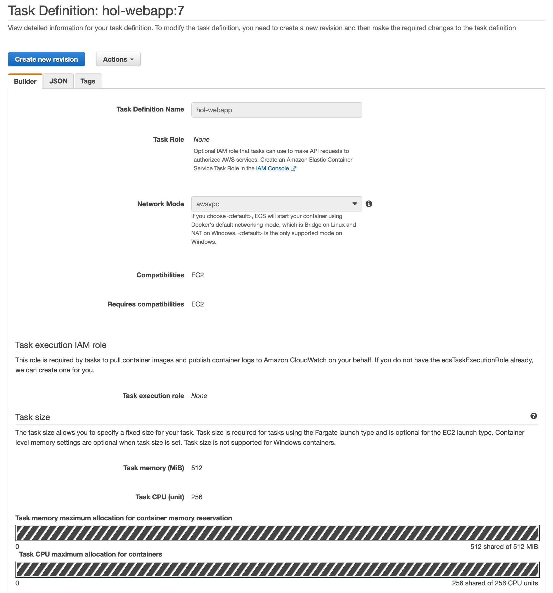

# Task Definition 생성하기

ecsTaskExecutionRole을 삭제하고 아래의 가이드로 할것

## Json을 통해서 Task Definition 생성하기

1. [https://console.aws.amazon.com/ecs/](https://console.aws.amazon.com/ecs/) 에서 Amazon ECS 콘솔을 엽니다.

2. 왼쪽 탐색 창에서 Task Definitions(작업 정의), Create new Task Definition(새 작업 정의 생성)을 차례대로 선택합니다.

3. Select compatibilities(호환성 선택) 페이지에서 **EC2**를 선택하고 Next step 버튼을 누릅니다.

4. 화면을 아래로 스크롤 해서 Configure via json 버튼을 누릅니다.

    

5. 윈도우즈 혹은 Mac에서 에디터를 열어서 아래의 텍스트를 붙여넣습니다.  YOUR_IMAGE_URI에 앞의 실습에서 생성한 ECR 리포지토리 URI를 입력합니다.

    > **주의: EC2 기반의 클러스터에서 EC2 기반의 Task Definition을 통해 Task를 실행할때는 별도의 task execution 역활을 정의하지 않습니다!!**

    ```json
    {
    "containerDefinitions": [{
        "name": "hol-webapp",
        "image": "<YOUR_IMAGE_URI>",
        "essential": true,
        "portMappings": [{
        "hostPort": 80,
        "protocol": "tcp",
        "containerPort": 80
        }]
    }],
    "requiresCompatibilities": [
        "EC2"
    ],
    "networkMode": "awsvpc",
    "cpu": "256",
    "memory": "512",
    "family": "hol-webapp"
    }
    ```

6. 실제로 잘 작성된 json 파일은 다음과 같습니다. 띄워쓰기 및 쌍따옴표를 생략하지 않도록 주의합니다.

   > image URI를 정확하게 확인하고 입력합니다.

    ```json
    {
    "containerDefinitions": [{
        "name": "hol-webapp",
        "image": "01234567890.dkr.ecr.us-west-2.amazonaws.com/containerhol/webapphol",
        "essential": true,
        "portMappings": [{
        "hostPort": 80,
        "protocol": "tcp",
        "containerPort": 80
        }]
    }],
    "requiresCompatibilities": [
        "EC2"
    ],
    "networkMode": "awsvpc",
    "cpu": "256",
    "memory": "512",
    "family": "hol-webapp"
    }
    ```

7. 팝업창에 위에서 작성한 json 포맷의 파일을 붙여넣고 save 버튼을 누릅니다.

8. 정상적으로 json파일이 입력됐다면 Create 버튼을 눌러 task definition을 생성합니다.

9. 완료가 되면 다음과 같은 화면을 확인할 수 있습니다. 각 항목을 보고 원하는 스펙으로 생성이 됐는지 확인을 해봅니다.

    

---

## 참고

### (생략할 것) Fargate로 클러스터를 구성하고 Task Definition을 사용할때의 Task Definition 예제

```json
{
"executionRoleArn": "arn:aws:iam::012345678910:role/ecsTaskExecutionRole",
"containerDefinitions": [{
    "name": "hol-webapp",
    "image": "01234567890.dkr.ecr.us-west-2.amazonaws.com/containerhol/webapphol",
    "essential": true,
    "portMappings": [{
    "hostPort": 80,
    "protocol": "tcp",
    "containerPort": 80
    }]
}],
"requiresCompatibilities": [
    "FARGATE"
],
"networkMode": "awsvpc",
"cpu": "256",
"memory": "512",
"family": "hol-webapp"
}
```

> ECS 클러스터를 생성할떄 "ecsInstanceRole"이 자동 생성되었고 EC2 기반의 ECS 클러스터는 이 역할을 기반으로 ECR 이미지 레지스트리에서 이미지를 가지고 와서 Task를 실행한다. 이와는 다르게 Fargate는 완전관리형 Serverless 서비스이기 때문에 TASK를 실행하기 위한 role을 정의해야합니다. TaskDefinition을 정의할때 위와 같이 정의를 하면 자동으로 **ecsTaskExecutionRole** 을 생성합니다.

### (생략할 것) ECS Task 실행을 위한 IAM 역할 수동 생성하기

1. 이 [링크를 클릭하여 AmazonECSTaskExecutionRolePolicy 를 가진 IAM 역할을 생성합니다.](https://console.aws.amazon.com/iam/home?region=us-west-2#/roles$new?step=type)

2. AWS service 와 EC2 를 선택하고 Next 버튼을 클릭합니다.

3. **"AmazonECSTaskExecutionRolePolicy"** 를 Filter Policies에 입력하고 체크를 한 다음에 Next 버튼을 클릭합니다.

4. Tag 입력은 생력합니다. 바로 리뷰를 위해서 Next 버튼을 누릅니다.

5. Name에 **ecsTaskExecutionRole** 을 입력하고 Create Role 버튼을 누릅니다.

## [다음: Service에서 사용할 Application Load Balancer 생성하기](create-alb.md)

## [메인페이지로 돌아가기](../README.md)

## [이전: ECR 클러스터 생성하기](create-ecr-cluster.md)
